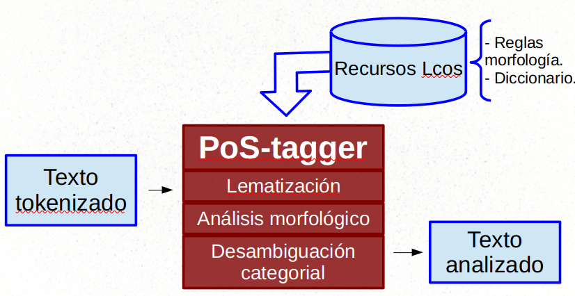
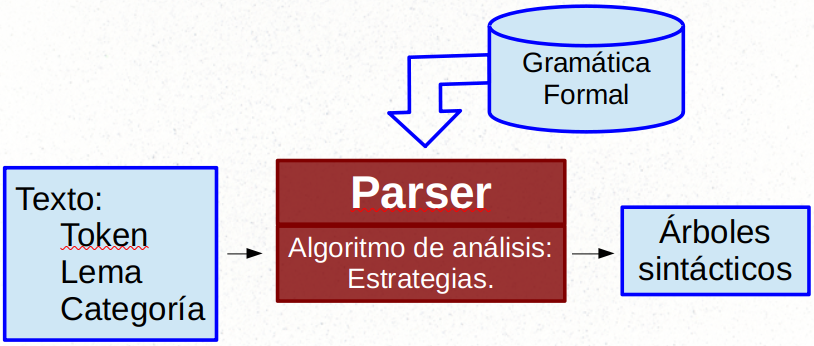
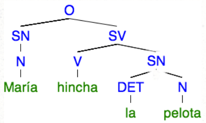
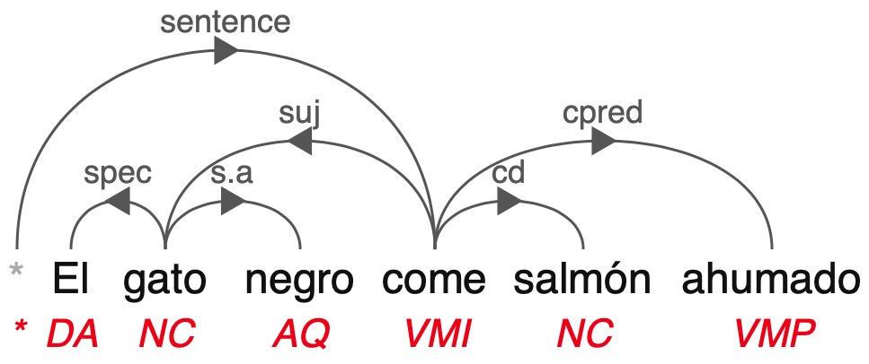
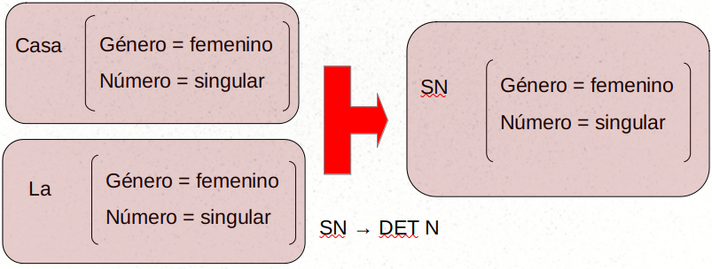

(label_PoS)=
Análisis categorial y sintáctico
=================================

## Unidades de comunicación básica. La palabra. *Type*, *token* y lema.

Si bien se suele utilizar como unidad mínima y básica de comunicación, la palabra es un concepto vago que no tiene una definión clara en la lingüística.

En lingüística de corpus se trabaja con dos conceptos relacionados: *type* y *token*.

- *Token* es cada una de las secuencias de caracteres separadas por espacio en blanco.
- *Type* son todos los *tokens* iguales.

Así, para medir el tamaño del corpus se indica el número de *tokens* y el cálculo de frecuencias más simple que se puede hacer el la cantidad de *tokens* por cada *type*.

La tokenización, aún así, presenta algunos aspectos que deben ser tenidos en cuenta como signos de puntuación, unidades multipalabra (como formas complejas del verbo Ej. "he comido") o contracciones ("del", "al") y formas aglutinantes ("dáselo").

*Type* y *token* se refieren siempre a formas flexionadas, es decir, a formas con variaciones morfológicas. Así, "catamos" y "cantaré" son *tokens* distintos; al igual que "casa" y "casas".

Para agrupar todos los *tokens* relacionados con la misma palabra (es decir, la forma sin flexionar o la unidad léxica que podemos encontrar, por ejemplo, en los diccionarios) se realiza un proceso de _lematización_. La lematización es asignar a cada palabra su forma no marcada: infinitivo para verbos, forma masculino singular para nombres y verbos (es decir, la forma que aparece en el diccionario). El lema es una manera de nombrar la palabra en toda su diversidad flexiva.

La lematización es un fenómenos complejo porque es necesario analizar morfológicamente la palabra para determinar su lema. Ej. El lema del *token* "traje" puede ser "traer" (si es verbo) o "traje" (si es nombre).

Un proceso similar pero más sencillo es el *stemming*: reducir cada *token* a su raíz o lexema (la parte invarible que, en principio, asume el significado general de la palabra).

> Reflexión: para minería de textos, ¿qué es mejor, dejar el corpus con los *tokens*, lematizarlo o trabajar solo con las raíces léxicas (*stemm*)? 

## Análisis morfológico y categorial.

El objetivo general de la anotación categorial (*PoS Tagger*): asignar a cada palabra de un texto su categoría gramatical correspondiente. En concreto, a cada *token* del texto (incluidos signos de puntuación, etc) se le asigna:

- lema,
- categoría gramatical,
- rasgos morfológicos.

El mayor problema viene en la selección de la categoría gramatical por los problemas de ambigüedad categorial que vimos en la sesión anterior.

### Fundamentos lingüísticos (a modo de recordatorio).

Categorías gramaticales: agrupaciones de palabras ("paradigmas") según sus rasgos distributivos, morfológicos y (en menor medida) semánticos.

ESP: artículo, sustantivo, adjetivo, pronombre, verbo, adverbio, preposición, conjunción e interjección.

Por su función en el texto: categorías con significado léxico vs. "significado" gramatical (solo aportan información gramatical).

Por su flexión: variables e invariables.

Categorías abiertas vs cerradas.

### Importancia en Minería de textos

Base para análisis sintáctico y semántico.

Un pre-proceso muy común en Minería de Textos es eliminar las "stop-words", es decir, las palabras de categorías gramaticales sin significado semántico (artículos, preposiciones, conjunciones, etc.). En ocasiones además las palabras se lematizan. En ambos casos es necesario un análisis categorial (aunque sea un simple filtro de "stop-words"). Algunas aplicaciones dependen de las categorías gramaticales, como: 

- extracción de entidades --> nombres propios;
- extracción de eventos --> verbos y nombres;
- extracción de sentimientos --> adjetivos;
- detección de autoría --> categorías cerradas;
- etc.

### Representación de la información morfológica y categorial

La información categorial y morfológica se representa explícitamente mediante juegos de etiquetas.

Actualmente hay diversas propuestas. Es necesario saber con qué juego de etiquetas representa la información el sistema de PoS que estemos utilizando par poder interpretar la información correctamente.

Algunas propuestas:

- BROWN corpus:

[http://www.helsinki.fi/varieng/CoRD/corpora/BROWN/tags.html](http://www.helsinki.fi/varieng/CoRD/corpora/BROWN/tags.html)

- Penn Treebank tag set:

[https://www.cs.upc.edu/~nlp/SVMTool/PennTreebank.html](https://www.cs.upc.edu/~nlp/SVMTool/PennTreebank.html)

- EAGLES tag set:

[http://www.ilc.cnr.it/EAGLES96/annotate/annotate.html](http://www.ilc.cnr.it/EAGLES96/annotate/annotate.html)

[http://blade10.cs.upc.edu/freeling-old/doc/tagsets/tagset-es.html](http://blade10.cs.upc.edu/freeling-old/doc/tagsets/tagset-es.html)

[https://freeling-user-manual.readthedocs.io/en/latest/tagsets/](https://freeling-user-manual.readthedocs.io/en/latest/tagsets/)

- Universal tagset (*Universal dependencies project*):

[https://universaldependencies.org/u/pos/](https://universaldependencies.org/u/pos/)

### Arquitectura de un *PoS_tagger*. Algoritmos clásicos de desambiguación.

Ejemplo: Freeling.

### Algoritmos de desambiguación categorial (aproximación histórica)

#### Modelo de reglas simples.

Sistema TAGGIT (1950).
71 etiquetas + 3300 reglas. 77% de precisión.

Reglas: expresiones regulares tipo

    \b.*ing\b = Verbo Infinitivo
    \b.*mente\b = adverbio
    las\s[a-z]*as → Nombre femenino plural
    etc.

### Modelo estadístico: cadena de markov.

Tiene en cuenta el contexto de aparición de las palabras.
Basados en bigramas.

Calculan dos tipos de probabilidades:
     Léxica: p(W|T)
     Contextual: p(W|T|Ctx)

ctx = palabra anterior --> bigrama.

### Modelo oculto de Markov

Basado en la probabilidad de cadenas de etiquetas (cadena oculta).

Dos tipos de probabilidades:
- Probabilidad de emisión = p(W|T)
- Probabilidad de transmisión = p(T|T-1). Esta es la parte oculta.

Así, la probabilidad final queda como:

    p(W|T) = p(W|T) * p(T|T-1)

Proceso iterativo: primero analiza lo no ambiguo, luego hace una segunda vuelta calculando probabilidades de transición y re-anotando, hasta llegar a situación estable (fin).

### Gramáticas de restricciones (*Constraint grammar*)

Modelo teórico: este tipo de gramáticas no dice cómo es un idioma, sino cómo NO es.

Las reglas, por tanto, son reglas negativas. Dada una ambigüedad, las reglas indican cuál de las opciones seguro que no es. Combinando restricciones se llega al final a la solución correcta.

Las reglas son condicionales al contexto (si la palabra anterior es X, la siguiente NO es Y).

Ejemplo:
     "Un verbo no va precedido de artículo". 

Sistema ENGCG (1990)

#### Modelos basados en aprendizaje automático.

Sistemas supervisados. Aprendizaje a partir de un corpsu anotado a mano y validado por lingüistas.

Diferentes algoritmos: árboles de decisión, vectores de soporte (SVM), etc.

Ejemplo "Transformation-based Tagger" (Brill 1995). Proceso iterativo donde va aprendiendo reglas, cada vez más específicas. Analiza aplicando primero las específicas y luego las generales. Refinamiento: revisón manual de cada iteración.

### Situación actual

Aproximaciones multilingües basadas en *embeddings* y redes neuronales:

[http://nlpprogress.com/english/part-of-speech_tagging.html](http://nlpprogress.com/english/part-of-speech_tagging.html)

### Recursos.

Cualquier sistema de PLN parte de un PoS tagger. Es el análisis básico.

- Freeling [http://nlp.lsi.upc.edu/freeling/index.php/](http://nlp.lsi.upc.edu/freeling/index.php/)
- SpaCy: [https://spacy.io/](https://spacy.io/)
- NLTK: [http://www.nltk.org/](http://www.nltk.org/)
- Standford CORE NLP: [https://stanfordnlp.github.io/CoreNLP/](https://stanfordnlp.github.io/CoreNLP/)
- Google CLOUD: [https://cloud.google.com/natural-language/](https://cloud.google.com/natural-language/)

y muchos más

## Análisis sintáctico.

Sintaxis: agrupación y relaciones de las palabras dentro de una oración.

Análisis automático: *parser*

### Arquitectura estándar de un *parser*

### Modelos de representación

Análisis basado en _constituyentes_

Análisis basado en _dependencias_

(Créditos de la imagen [aquí](http://liceu.uab.cat/~joaquim/language_technology/NLP/PLN_analisis.html#An%C3%A1lisis_de_dependencias))

### Principal problema computacional

Ambigüedad estructural:

    "Ayer vi a tu hermano con los prismáticos"

Ambigüedad coordinación:

    "Sirve los platos y los cubiertos limpios"

### Gramáticas formales

Conjunto de reglas formales de análisis sintático.

#### Context free grammars

    G = (NT, T, S, P)
    NT: {no terminales},
    T: {terminales},
    S: Símbolo inicial
    P: Reglas de producción A -> w: 
        A   NT
        W   (NT U T)*

Tal que

    NT ={S,NP,VP,nprop,n,v,det}, 
    T ={Pepe,manzana, come,una},
    P:
        S -> NP VP
        NP -> nprop
        NP -> det  n
        VP -> v
        VP -> v NP

Estas gramáticas eran muy limitadas y fueron ampliadas con estructuras de rasgos y técnicas de unificación.

En lingüística se han desarrollado diferentes modelos basados en estas técnicas las *Head-driven phrase structure grammar* o las *Lexical-Functional Grammar* (que sigue siendo un modelo válido: [https://ling.sprachwiss.uni-konstanz.de/pages/home/lfg/](https://ling.sprachwiss.uni-konstanz.de/pages/home/lfg/) )

#### *Probabilistic Context Free Grammar* y modelos probabilísticos

Añaden peso estadístico a cada regla.

    SV → V SP SP (0.5)
    SV → V SP (0.3)
    SV → V (0.2)

Modelos de aprendizaje automático.

Corpus de aprendizaje y evaluación: *treebanks*

- Penn Treebank:

[https://catalog.ldc.upenn.edu/LDC99T42](https://catalog.ldc.upenn.edu/LDC99T42)
[https://www.kaggle.com/nltkdata/penn-tree-bank](https://www.kaggle.com/nltkdata/penn-tree-bank)

- Ancora (español, catalán):
[http://clic.ub.edu/corpus/en/ancora-descarregues](http://clic.ub.edu/corpus/en/ancora-descarregues)

Y muchos otros

### *Chunkers*

En ocasiones el análisis sintáctico completo (*full parsing*) es complejo, consume mucho recurso y no suele obtener buenos resultados.

Lo normal es realizar _análisis sintáctico parcial_ o *chunkers*: extraer agrupaciones sintáticas (*chunks*) sin llegar a derivar el árbol sintáctico completo.

### Estrategias

Descendente:
Recursive Descendent:

    import nltk
    nltk.app.rdparser()

Ascendente
Shift Reduce:

    import nltk
    nltk.app.srparser()

### Situación actual

*Transition-based dependency parsing* (Nivre 2014). Algoritmo shift-reduce.

*Neural Network Dependency Parser*: [https://nlp.stanford.edu/software/nndep.shtml](https://nlp.stanford.edu/software/nndep.shtml)

Modelo de dependencias universal: *Universal Dependencies*:

> The Universal Dependencies project (Nivre et al., 2016) provides an inventory of dependency relations that arelinguistically motivated, computationally useful, and cross-linguistically applicable. (Juravsky y Martin 2020, cap. 14)

Representación vectorial (*embeddings*).

[http://nlpprogress.com/english/constituency_parsing.html](http://nlpprogress.com/english/constituency_parsing.html)

[http://nlpprogress.com/english/dependency_parsing.html](http://nlpprogress.com/english/constituency_parsing.html)

## Bibliografía

Juravsky y Martin (2020) *Speech and Language Processing*. [https://web.stanford.edu/~jurafsky/slp3/](https://web.stanford.edu/~jurafsky/slp3/) 
(Caps 12-14)
